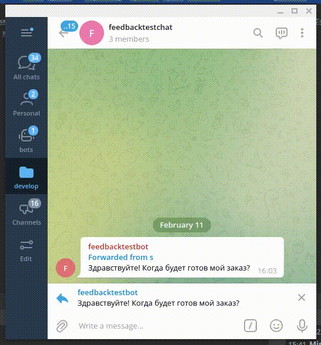

Шаблоны ответов
=============

Иногда в поддержке приходится отвечать на однотипные вопросы однотипными ответами. Например:

   Q. ``Здравствуйте! Когда будет доставлен мой заказ?``

   A. ``Добрый день. Ваш заказ принят в обработку. Среднее время доставки 2-4 дня. Мы уведомим вас об изменении статуса заказа``

Чтобы не печатать каждый раз одинаковые тексты, в Olgram можно задать список шаблонных ответов. Тогда диалог с
пользователем может выглядеть так:

Заметьте, чтобы увидеть список вариантов ответов, нужно упомянуть вашего feedback бота и нажать пробел

Как настроить шаблоны
---------------------

Шаблоны можно задать в меню Olgram бота Текст -> Автоответчик -> Шаблоны ответов.

.. image:: ../images/settemplates.jpg
   :width: 300

Обязательно включите inline mode в вашем feedback боте. Для этого отправьте @BotFather команду ``/setinline``
и следуйте инструкциям

.. note::

   Может пройти несколько минут, прежде чем добавленные в OlgramBot шаблоны появятся в списке вашего feedback бота

